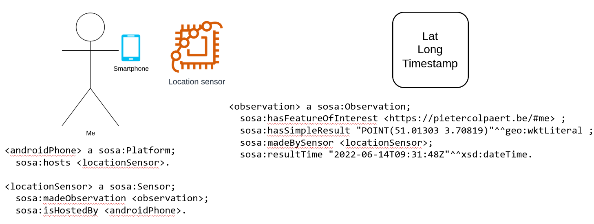

# LocationHistory App

# Location History App

The app prototype, let's the user capture their location from browser after logging in with their WebID and store their raw location data as RDF which is validated against a [SHACL](https://www.w3.org/TR/shacl/) shape. The Users can also request location from other users using their webID. They can also approve/revoke the requests for sharing location from other users.

This prototype is developed as part of the SOLIDLAB Research Challenge [#10](https://github.com/SolidLabResearch/Challenges/issues/10).

## Running the app

### Live

The application is hosted on [github pages](https://sindhu-vasireddy.github.io/LocationHistory/).

### Local

If you want to test out the application locally, execute the following steps:

1. Clone the Repository.
2. Install the node dependencies using:
   ```npm ci```
4. Generate the webpack bundle using:
   ```npm run build```
6. Start the server using:
   ```npm start```

### Note:-
A. Enter your webid to login to your pod
e.g. (https://data.knows.idlab.ugent.be/person/SindhuVasireddy/#me)
B. This is a work in progress, the prototype is being added with additional features continously.

## How does the app work

### Model

[SSN/SOSA](https://www.w3.org/TR/vocab-ssn/) is used to model the location data and how it was generated.

The device that runs the application is encoded as a [`sosa:Platform`](https://www.w3.org/TR/vocab-ssn/#SOSAPlatform). The location sensor on that device is encoded as a [`sosa:Sensor`](https://www.w3.org/TR/vocab-ssn/#SOSASensor).

A location measurement includes the longitude, the latitude and a timestamp. On top of that, the persons WebID that is using the  location app is encoded as well.
All the measurement data is encoded as an [`sosa:Observation`](https://www.w3.org/TR/vocab-ssn/#SOSAObservation).

A visualisation of this modelling can be seen in the image below.



Furthermore, a full example can be found at [here](vocab/examples/location_ssn.ttl). A [SHACL shape](setup/shacl/shapes.ttl) is also included to validate the model.

### Storage

The data points are stored in a container with location `$StorageSpace$public/YourLocationHistory/Data/` , where `$StorageSpace$` is the root storage of the pod.

#### Discovery of the root pod

The application discovers the root storage of your pod based on the `pim:storage` predicate as defined in the [Solid WebID](https://solid.github.io/webid-profile/#storage).

<details>
<summary>Extra information</summary>

However, storage triples are **optional** in a Solid Profile. So as a fallback the URL corresponding to the `solid:oidcIssuer` is used when a storage triple is not present.

In some cases this will point as well to your root storage, which means the application might work in that case. However, such a triple, [according to the specification](https://solid.github.io/webid-profile/#identity-provider), is only used  "*to indicate the address of a Solid Identity Provider capable of authenticating the WebID owner.*"

Simply adding a Storage triple, as described in [https://solid.github.io/webid-profile/#storage](https://solid.github.io/webid-profile/#storage), will make sure the application works for your solid pod.
</details>


### Requesting access to a friends location

The design of how to ask and give access to your friends is explained [here](./UML/) with UML diagrams.
